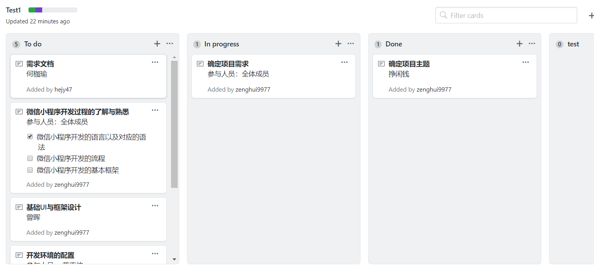
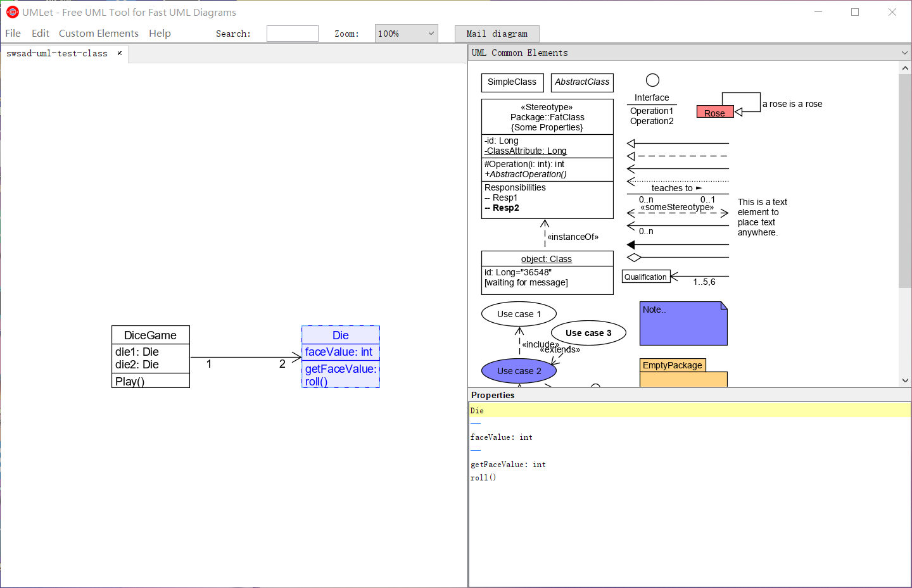

# Homework 2

## 1.简答题
* **用简短的语言给出对分析、设计的理解。**
    
    * 分析：做正确的事  do the right thing
    * 设计：把事情做对  do the thing right

* **用一句话描述面向对象的分析与设计的优势。**
    
    * 优势：通俗易懂，便于正确的对需求进行分析与设计，由于无论是行业的专家还是软件开发实现者都可以利用一种共同的通俗易懂的标注，理解需求中的内容以及他们之间的关系。

* **简述 UML（统一建模语言）的作用。考试考哪些图？**

    * UML： UML是指使分析和设计结果可视化的标准图表语言
    * UML的作用：
        
        * 进行代码可视化，对模型及元素进行抽象化的语义描述。
        * 描述和沟通用户的需求。
        * 定义软件系统的体系结构，体现模块间的联系与相互约束。
    * UML中的图：
        * 基本构造块： 事务，关系、图
        * 四类图：

            * 用例图：从用户角度描述：功能、执行者
            * 静态图：描述系统静态结构。如类图：概念以及关系；对象图：某种状态或时间段内，系统中活跃的对象及其关系；包图：描述系统的分解结构。
            * 行为图：描述系统的动态行为。如交互图：描述对象间的消息传递；状态图：描述对象的动态行为，如状态、事件、状态迁移、响应动作等；活动图：描述系统为完成某功能而执行的操作序列。
            * 实现图：描述系统的组成和分布状况。如构件图：描述组成部件及其关系；部署图：描述物理体系结构以及与软件单元的对应关系。
* **从软件本质的角度，解释软件范围（需求）控制的可行性**
    * 软件工程的本质特性： 

        * complexity 复杂性
        * conformity 一致性
        * changeability 可变性
        * invisibility 不可视性
    * 可行性：软件是不一致、不可视、易于变化的。不仅要能满足软件的变化，而且软件的非功能性需求的实现成本远远高于功能实现成本。其次在软件工程中由于上面四条本质特征，软件的开发存在一个2-8定律，20%的功能满足80%的需要，20%的测试发现80%错误，在软件分析中，并不是利用软件分析发现更多的功能和需求，而是确认有效的功能与需求。软件设计也不是追求先进的技术，而是控制变化附件的成本，使得软件生产的预算、时间能够得到掌控。因此软件的分析与设计能够在软件范围（需求）控制，并且可行。

## 2.项目管理实践
* 看板使用练习（提交看板执行结果贴图，建议使用 Git project）
* 使用截图工具（png格式输出），展现你团队的任务 Kanban
* 每个人的任务是明确的。必须一周后可以看到具体结果
* 每个人的任务是1-2项
* 至少包含一个团队活动任务

看板如下：

个人任务明确：为基本的UI构想与设计
团队任务为：微信小程序开发过程的了解与熟悉，通过了解微信小程序开发的语言以及语法，熟悉开发流程，了解基本框架。

## 3.UML绘图工具练习（提交贴图，必须使用 UMLet）
* 请在 参考书2 或 教材 中选择一个类图（给出参考书页码图号）
    
    在UMLet上练习的类图如下：

UMLet练习类图，参考UML和模式应用（原书第三版）第7页第一章图1-5 局部设计类图
