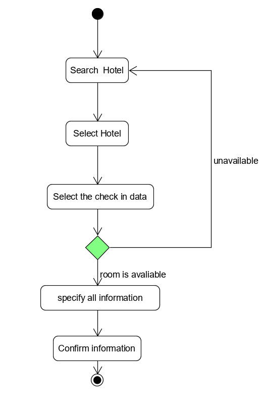

# Homework 5

**使用 UMLet 建模**

* 根据订旅馆建模文档，[Asg-RH.pdf]()：

    * 绘制用例图模型（到子用例）
        
        酒店预定系统由下面四个部分组成：Select Hotel, Make reservation, Use Shopping Basket,Make Payment
        
        用例图如下

        

    * 给出 make reservation 用例的活动图

        

* 根据课程练习“投递员使用投递箱给收件人快递包裹”的业务场景

    * 分别用多泳道图建模三个场景的业务过程

        * 场景一

            
        * 场景二

            
        * 场景三

            
    * 根据上述流程，给出快递柜系统最终的用例图模型
        
        * 用正常色彩表示第一个业务流程反映的用例
        * 用绿色背景表述第二个业务场景添加或修改的用例，以及支持 Actor
        * 用黄色背景表述第三个业务场景添加或修改的用例，以及支持 Actor

        最终得到用例图如下
        
