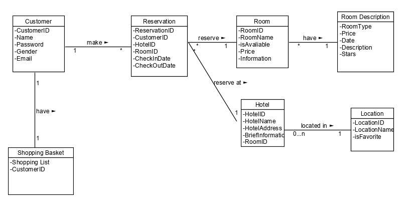
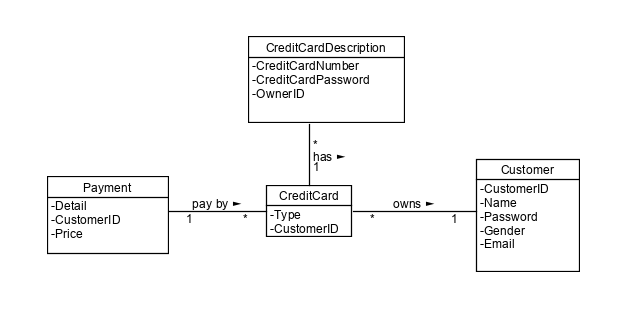
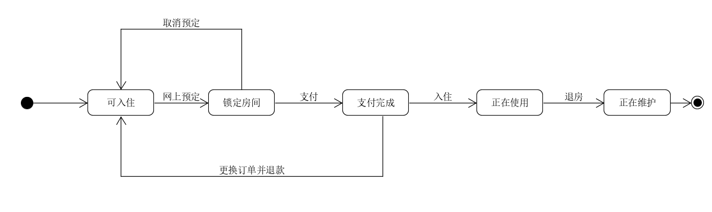
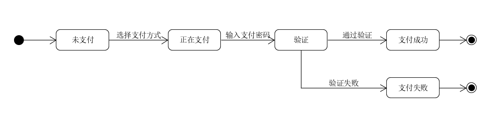

**使用 UMLet 建模**

* 1、使用类图，分别对 Asg_RH 文档中 Make Reservation 用例以及 Payment 用例开展领域建模。然后，根据上述模型，给出建议的数据表以及主要字段，特别是主键和外键

    * 注意事项：

        * 对象必须是名词、特别是技术名词、报表、描述类的处理
        * 关联必须有多重性、部分有名称与导航方向
        * 属性要注意计算字段
    * 数据建模，为了简化描述仅需要给出表清单，例如：

        * Hotel（ID/Key，Name，LoctionID/Fkey，Address…..）

Make Reservation 用例领域建模

对于Make Reservation，需要建立的类有：Reservation，Customer，Hotel，Shopping Basket，Room，Room Description，Location

* Hotel (HotelID/Key, LocationID/FKey, HotelName, HotelAddress, briefinformation, RoomID)
* Location (LocationID/Key, LocationName, isFavourite)
* Room (RoomID/Key, RoomName, isAvailable, Price, information)
* Room Description(Room Type,Price,Date,Description,Stars)
* Customer (CustomerID/Key,Name, Password,Gender,Email)
* Reservation (ReservationID/Key, CustomerID/FKey, HotelID/FKey, CheckInDate,CheckOutDate)
* Shopping Basket (CustomerID/FKey, Shopping List)

对于Payment，需要建立的类有：Payment，CreditCard，Customer，CreditCardDescription

* Payment (CustomerID/Key,Reservation_ID/FKey,Detail,Price)
* CreditCard (Type) 
* CreditCardDescription (CreditCardNumber/Key,CreditCardPassword,OwnerID)
* Customer (CustomerID/Key,Name,Password,Email,Gender)

* 2、使用 UML State Model，对每个订单对象生命周期建模

    * 建模对象： 参考 Asg_RH 文档， 对 Reservation/Order 对象建模。
    * 建模要求： 参考练习不能提供足够信息帮助你对订单对象建模，请参考现在 定旅馆 的旅游网站，尽可能分析围绕订单发生的各种情况，直到订单通过销售事件（柜台销售）结束订单。

        * 对于Reservatioin/Order 其状态有{可入住，锁定房间，支付完成，正在使用，正在维护}
        * 事件有 { 网上预订 ，取消预订，支付费用， 入住 ， 退房 ， 更换订单并退款 }

        状态建模为：

        

        * 对于支付方式，其状态有{未支付，正在支付，验证，支付成功，支付失败}
        * 事件有{选择支付方式，输入支付密码，通过验证，验证失败}
        
        状态建模为：

        
